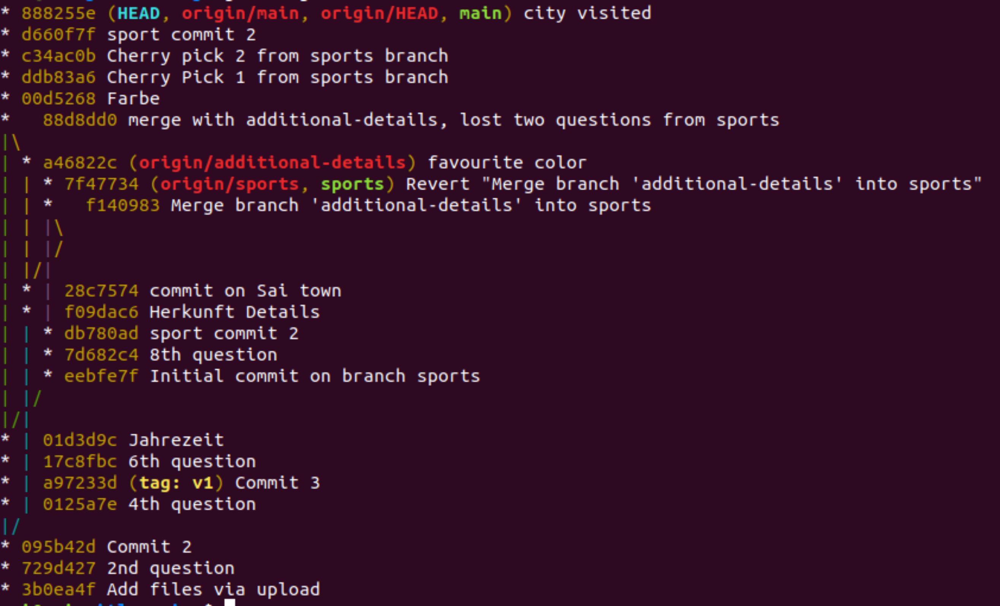

## Purpose?

This repository is just meant for practising git in a collborative environment

## Collaborators are-

* Lovish Goel
* Sai Sharath

## Learnings

### Two ways to update local branches with respect to remote branches-
1) A two step process which highlights the process happening in the background
```bash
# gets all the changes which are not available locally, 
# kinda like hitting refresh
$> git fetch 
# gives you an idea about the difference in state of your 
# local repository contents and what is available on the 
# remote repository
$> git status 
# this command finally updates the local repository 
# contents to keep it up to date with the remote 
# repository contents
$> git merge origin/main 
```
2) A single step process which hides all the rudimentary steps i.e. performs `fetch+merge` provided the remote branch
is already being tracked in the local repositiory. 
```bash
$> git pull
```
### Creating a branch at an old commit
```bash
# First the HEAD pointed has to be made to point to the 
# particular commit where we want to create a branch
$> git checkout past-SHA1
# then we can follow the usual procedure to create a
# branch here
$> git checkout -b new-branch-name
```
### Using git aliases and log output to understand the repositories history
An elegant ASCII style git FLOW graph can be generated using the following commands
which we can alias for easy accessability
```bash
$> git config --global alias.dlog 'log --decorate --oneline --graph --all' # just setting an alias for the long command so that we do not have to type that always
$> git dlog # here we use the alias we made
```
Here is an example of the current state of the repository as seen and obtained using
the `git dlog` alias

### Creating git lightweight tags, pushing them to remote and then renaming them
```bash
# create a lightweight tag
$> git tag v2
# It is worth noting that the **git push** command doesn't 
# automatically transfer tags to the remote servers. This 
# has to be done explicity and is no different than pushing 
# branches to remote repositories, for example if the tag was v2
$> git push origin v2

# oh oh! but we completely missed v1, so we wish to rename it 
$> git tag new old
# $> git tag v1 v2
$> git tag -d old
# $> git tag -d v2
$> git push origin :refs/tags/old
$> git push --tags

# and so that colleagues also have updated tags, this should 
# be run in their system, otherwise they will still have the old tag
$> git pull --prune --tags
```
### Ammending the most recent commit message
```bash
$> git commit --amend
# the previous command opens the pre configured editor which
# allows to edit the commit message. Once done, saving and exiting 
# will result in a new commit with a different SHA1 which 
# basically replace the existing commit

# once the commit message has been updated the new commit 
# has to be pushed to the remote which requires the force flag
# as this will result in data loss
$> git push  --force
```
### Ammending older commits
```bash
# Use the git rebase -i HEAD~n command to display a list of the
# last n commits in your default text editor.
$> git rebase -i HEAD~6

# the command will open your prefered text editor which allows 
# multiple actions to be taken which are
# reword = use commit, but edit the commit message
# edit = use commit, but stop for amending
# squash = use commit, but meld into previous commit
# fixup = like "squash", but discard this commit's log message
# exec = run command (the rest of the line) using shell

# so in this case, we make use of reword functionality to pick
# the commits whose messages we want to edit

# saving and closing will result in the commit messages of 
# the individual commits open up which can be edited 

# finally we carry out the same step as in the case of ammending 
# the most recent commit 
$> git push --force
```
